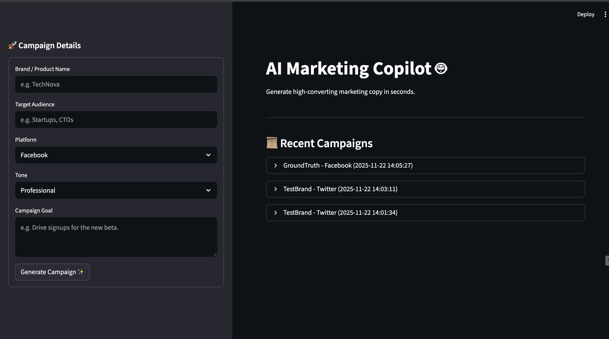

# 🚀 AI Marketing Copilot

**Generate high-converting marketing campaigns in seconds using the power of Llama-3.**

The **AI Marketing Copilot** is a production-ready workflow tool designed to help marketers and business owners instantly generate, validate, and manage marketing content. By combining **Streamlit** for the UI, **Groq** for ultra-fast AI inference, and **SQLite** for persistent storage, this application turns a simple prompt into a full marketing pack.

---

## ✨ Features

- **🎯 Targeted Content Generation**: Input your brand, audience, and goal to get tailored content.
- **⚡ Ultra-Fast Inference**: Powered by Groq's LPU inference engine running `llama-3.3-70b-versatile`.
- **🛡️ Automated Validation**: Built-in business logic checks for tone consistency and Call-to-Action (CTA) presence before showing results.
- **💾 Campaign History**: Automatically saves every valid campaign to a local SQLite database for future reference.
- **📋 One-Click Copy**: Dashboard interface with easy copy buttons for Ad Copy, Emails, Push Notifications, and Social Captions.

## 🖼️ Preview


## 💼 Real-World Use Cases
- ✔ Marketing agencies generating ads for multiple clients
- ✔ E-commerce brands launching seasonal campaigns
- ✔ Founders writing emails + social content without copywriters
- ✔ Performance marketers testing multiple copy variations

---

## 🛠️ Tech Stack

- **Frontend**: [Streamlit](https://streamlit.io/) (Python-based UI)
- **AI Model**: [Llama-3](https://llama.meta.com/) via [Groq API](https://groq.com/)
- **Backend Logic**: Python (Pipeline & Validation)
- **Database**: SQLite (Lightweight & Serverless)

---

## 🚀 Quick Start

### Prerequisites
- Python 3.8+
- A [Groq API Key](https://console.groq.com/)

### Installation

1. **Clone the repository** (if applicable) or navigate to the project folder.

2. **Set up a Virtual Environment** (Recommended)
   ```bash
   python3 -m venv venv
   source venv/bin/activate  # On Windows: venv\Scripts\activate
   ```

3. **Install Dependencies**
   ```bash
   pip install -r requirements.txt
   ```

4. **Configure Environment Variables**
   Create a `.env` file in the root directory and add your API key:
   ```bash
   GROQ_API_KEY=gsk_your_actual_api_key_here
   ```

### Running the App

Start the Streamlit dashboard:
```bash
streamlit run app.py
```
The app will open automatically in your browser at `http://localhost:8501`.

---

## 📂 Project Structure

```
ai-marketing-copilot/
├── app.py                  # 🏠 Main application entry point
├── requirements.txt        # 📦 Python dependencies
├── .env                    # 🔑 API keys (not committed)
├── backend/
│   ├── generator.py        # 🧠 Handles Groq API calls
│   ├── validator.py        # ⚖️ Validates content quality
│   └── pipeline.py         # 🔄 Orchestrates the generation flow
├── database/
│   ├── db.py               # 💾 Database connection & queries
│   └── models.sql          # 🗄️ Database schema
├── ui/
│   ├── input_form.py       # 📝 Sidebar input components
│   ├── dashboard.py        # 📊 Result display & copy buttons
│   └── utils.py            # 🎨 UI styling helpers
└── config/
    ├── settings.py         # ⚙️ App configuration
    └── prompts/            # 📜 Prompt templates
```

## 🧪 Testing

To verify the backend logic without launching the UI, run the included test script:
```bash
python test_backend.py
```

---

## 📝 License

This project is open-source and available for personal and educational use.
